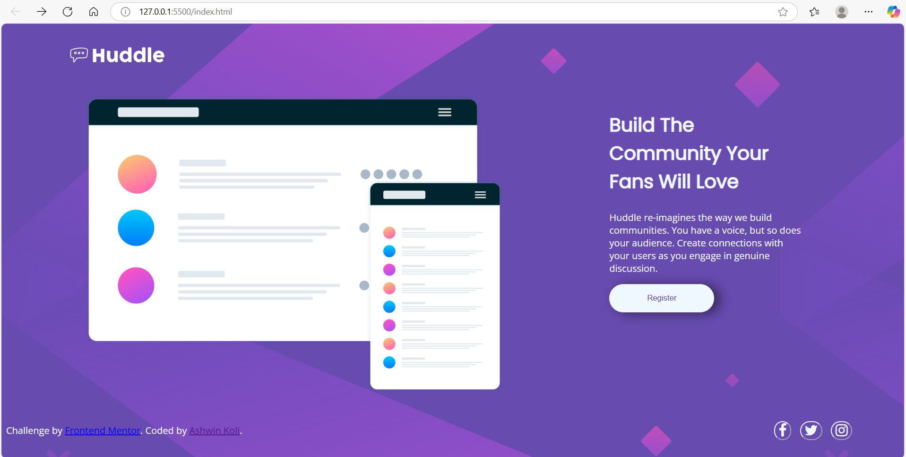

# Frontend Mentor - Huddle landing page with single introductory section solution

This is a solution to the [Huddle landing page with single introductory section challenge on Frontend Mentor](https://www.frontendmentor.io/challenges/huddle-landing-page-with-a-single-introductory-section-B_2Wvxgi0).  

## Table of contents

- [Overview](#overview)
  - [The challenge](#the-challenge)
  - [Screenshot](#screenshot)
  - [Links](#links)
- [My process](#my-process)
  - [Built with](#built-with)
  - [What I learned](#what-i-learned)
  - [Continued development](#continued-development)
  - [Useful resources](#useful-resources)
- [Author](#author)
- [Acknowledgments](#acknowledgments)

## Overview

### The challenge

Users should be able to:

- View the optimal layout for the page depending on their device's screen size
- See hover states for all interactive elements on the page

### Screenshot

**Desktop View**

**Small Device View (screen size < 375px)**

### Links

- Solution URL: [Source Code](https://github.com/koliashwin/Simple-landing-page)
- Live Site URL: [Github pages](https://koliashwin.github.io/Simple-landing-page/)

## My process

### Built with

- HTML
- CSS custom properties
- Flexbox
- CSS Grid

**There are only 2 main files in the project:**
- **index.html** : this file contains the html code
- **styles.css** : this file contains CSS for styling

### What I learned

I learnd about responsive web design and how to use @media queries in CSS

### Continued development

I'll be working on some frontend libraries in my next projects. Also I want to practice grid system for better control of web elements.

## Author

- Frontend Mentor - [@koliashwin](https://www.frontendmentor.io/profile/koliashwin)
